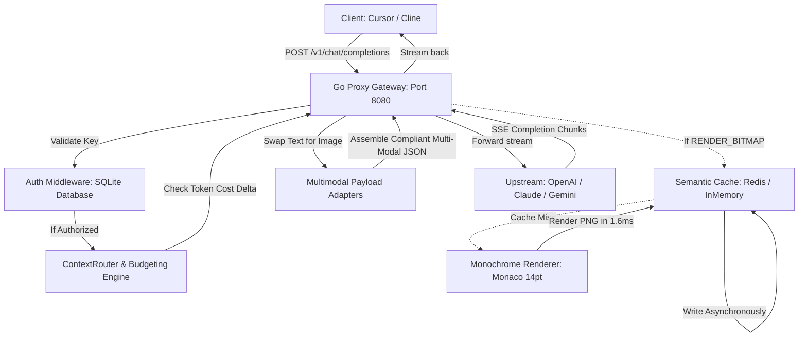

# Universal Context Optimizer (UCO)

[](https://goreportcard.com/report/github.com/trvst-svg/Universal-Context)
[](https://opensource.org/licenses/MIT)

**UCO** (Universal Context Optimizer) is a high-performance, provider-agnostic context optimization proxy for multimodal large language models (LLMs).

---

## The Core Concept: Text is Expensive, Images are Cheap

When you build coding agents (like Cursor, Cline, or custom CLI assistants), you frequently feed them massive amounts of static context—such as entire multi-file codebases, API documentation, or deep chat history. 

This static text eats up tens of thousands of input tokens on every single turn. This leads to slow responses, hitting context limits, and massive API bills.

**UCO solves this by exploiting a quirk in LLM pricing.** 

Instead of sending massive blocks of static text to the AI, UCO intercept requests, converts that text into a highly-compressed, crisp, non-anti-aliased monochrome image (bitmap) in memory, and swaps the text out for this image. The dynamic prompt (your actual question) remains text.

```
                    ┌─────────────────────────┐
                    │  Original Text Request  │
                    │  (e.g., 6,000 tokens)   │
                    └────────────┬────────────┘
                                 │
                                 ▼
                     Universal Context Optimizer
                                 │
         ┌───────────────────────┴───────────────────────┐
         ▼                                               ▼
┌─────────────────┐                             ┌────────────────┐
│   Static Text   │                             │ Dynamic Prompt │
│  (Codebase/Doc) │                             │   (Question)   │
└────────┬────────┘                             └────────┬───────┘
         │ (Rendered to PNG in ~1.6ms)                   │
         ▼                                               │
┌─────────────────┐                                      │
│ Crisp B&W Image │                                      │
│  (765 tokens)   │                                      │
└────────┬────────┘                                      │
         └───────────────────────┬───────────────────────┘
                                 │ (Mutated Payload)
                                 ▼
                    ┌─────────────────────────┐
                    │   Multimodal LLM Call   │
                    │   (OpenAI, Claude, etc) │
                    └─────────────────────────┘
```

Because modern vision models (like GPT-4o and Claude 3.5 Sonnet) have highly optimized OCR capabilities, they read the rendered code with 100% accuracy. By converting text to vision tokens, **UCO reduces the input token footprint of large files by up to 85%**, cutting your API costs dramatically.

---

## What UCO Does

1. **Transparent Proxying**: Runs locally as a standard proxy listening on `POST /v1/chat/completions`. You can plug it directly into tools like Cursor by pointing their OpenAI/Anthropic Base URL to `http://localhost:8080`.
2. **Context Router**: Automatically parses incoming message arrays, isolates static attachments/system prompts from your final dynamic instruction, and evaluates their token cost.
3. **Smart Token Budgeting**: Compares the cost of sending a block as text vs. rendering it as an image. If it's a short text block (where the image overhead isn't worth it), it leaves it as text. If it's a large block, it triggers the renderer.
4. **Sub-Millisecond Monochrome Renderer**: Renders code line-by-line using system monospace fonts. It applies pixel-level thresholding to strip anti-aliasing (making it perfectly sharp for AI OCR) and encodes it as a high-speed PNG in **1.6 milliseconds**.
5. **Semantic Cache**: Computes the SHA-256 hash of text blocks and queries an in-memory/Redis cache. If it hits, it retrieves the image buffer instantly, bypassing the rendering stage entirely.
6. **Under-the-Hood Payload Mutation**: Automatically translates the internal optimized representation into provider-compliant multimodal formats for **OpenAI**, **Anthropic (Claude)**, and **Google Gemini** before forwarding.

---

## Architecture Flow



---

## How to Get Started

### 1. Prerequisites
- **Go** (1.20+)
- **System Monospace Font**: UCO searches for `Monaco.ttf`, `Menlo.ttc`, or `Courier New.ttf` on macOS. It can be configured for Linux/Windows by supplying custom TTF font paths.
- **Redis** (Optional): Attempts to connect to `localhost:6379`. Falls back automatically to a thread-safe local in-memory cache if offline.

### 2. Build the Application
Clone the repository and compile the Go binary:
```bash
go build -o uco-proxy main.go
```

### 3. Initialize/Configure Client API Keys
On first run, UCO will create a local SQLite database named `uco.db` and bootstrap a default test key:
- **Default Key**: `uco-test-key-12345`

You can manage client keys directly inside the `api_keys` SQLite table.

### 4. Run the Proxy Server
Launch the proxy server. By default, it binds to port `8080`:
```bash
# Optional: Set upstream key override if testing client environments
# that only accept a single API Key (like Cursor)
export OPENAI_API_KEY="your-real-openai-api-key"

./uco-proxy
```

---

## How to Use UCO

### Pointing your IDE/Client to the Proxy
To route completions requests through UCO, update the API settings in your client application:
- **Base URL**: `http://localhost:8080/v1`
- **UCO Authorization Key**: Send your UCO API Key (`uco-test-key-12345`) in either the `X-UCO-API-Key` header or the standard `Authorization: Bearer <key>` header.

### Triggering Optimization
Send a completions request containing a large static system prompt or codebase attachment. 

For example, using `curl`:
```bash
# Build a large payload (~300 lines of code/text)
payload=$(python3 -c "
import json
large = '\n'.join(['Line {:03d}: This is dense, token-heavy documentation describing system behaviors.'.format(i) for i in range(300)])
print(json.dumps({
    'model': 'gpt-4o',
    'messages': [
        {'role': 'system', 'content': large},
        {'role': 'user', 'content': 'What is the summary of the above?'}
    ],
    'stream': true
}))
")

# Send the request to UCO
curl -i -N http://localhost:8080/v1/chat/completions \
  -H "Content-Type: application/json" \
  -H "Authorization: Bearer uco-test-key-12345" \
  -d "$payload"
```

### Inspecting logs
Watch the server stdout. You will see UCO performing token cost budgeting, caching evaluations, rendering, and payload size conversions in real-time:
```
[UCO Auth] Client 'UCO Default Test Client' successfully authenticated.
[UCO Info] ContextRouter Analysis for model 'gpt-4o':
[UCO Telemetry] {"model":"gpt-4o","original_text_tokens":5708,"optimized_vision_tokens":773,"input_rate_per_m_usd":2.5,"original_cost_usd":0.01427,"optimized_cost_usd":0.00193,"cost_savings_usd":0.01233,"savings_percentage":86.45}
  - Msg 0 [system] (Static: true) -> Strategy: RENDER_BITMAP (Text: 5700 T, Vision Est: 765 T)
[UCO Info] Cache MISS for Msg 0 (hash: uco:img:6a667d73). Rendering text to image...
[UCO Info] Rendered Msg 0 in 76.9ms (size: 368438 bytes)
  - Msg 1 [user] (Static: false) -> Strategy: KEEP_TEXT (Text: 8 T, Vision Est: 0 T)
[UCO Info] Async cache write successful for uco:img:6a667d73
[UCO Info] Mutated request payload size: 29836 -> 491544 bytes
```

---

## Observability & Telemetry

UCO automatically writes two forms of instrumentation:
1. **JSON logs to Stdout**: Useful for routing to external logging systems like Fluentd or Datadog.
2. **SQLite Database persistence**: Saves every execution metric in the `request_metrics` table inside `uco.db`.

You can query `uco.db` to check your running aggregates:
```sql
SELECT 
    COUNT(*) as total_requests,
    SUM(original_text_tokens) as total_raw_tokens,
    SUM(optimized_vision_tokens) as total_sent_tokens,
    SUM(cost_savings_usd) as total_usd_saved
FROM request_metrics;
```

---

## Running Tests
UCO includes a robust testing suite, including unit tests for rendering algorithms and payload adapters, as well as a mock-based, offline integration test suite verifying the proxy's concurrency:
```bash
go test -v ./...
```

---

## License
UCO is open-source software licensed under the [MIT License](LICENSE).